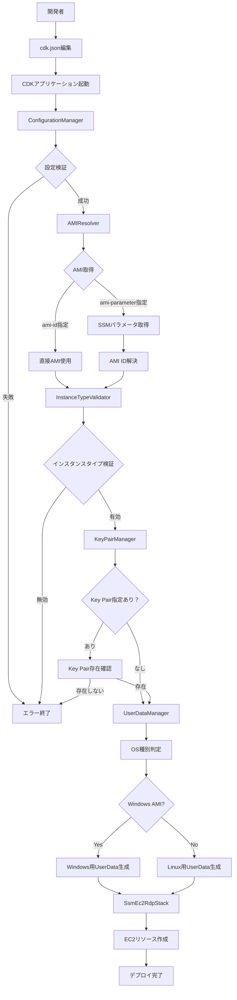
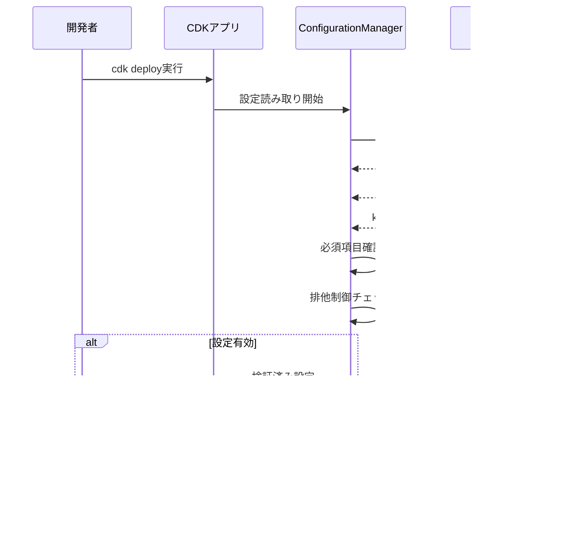
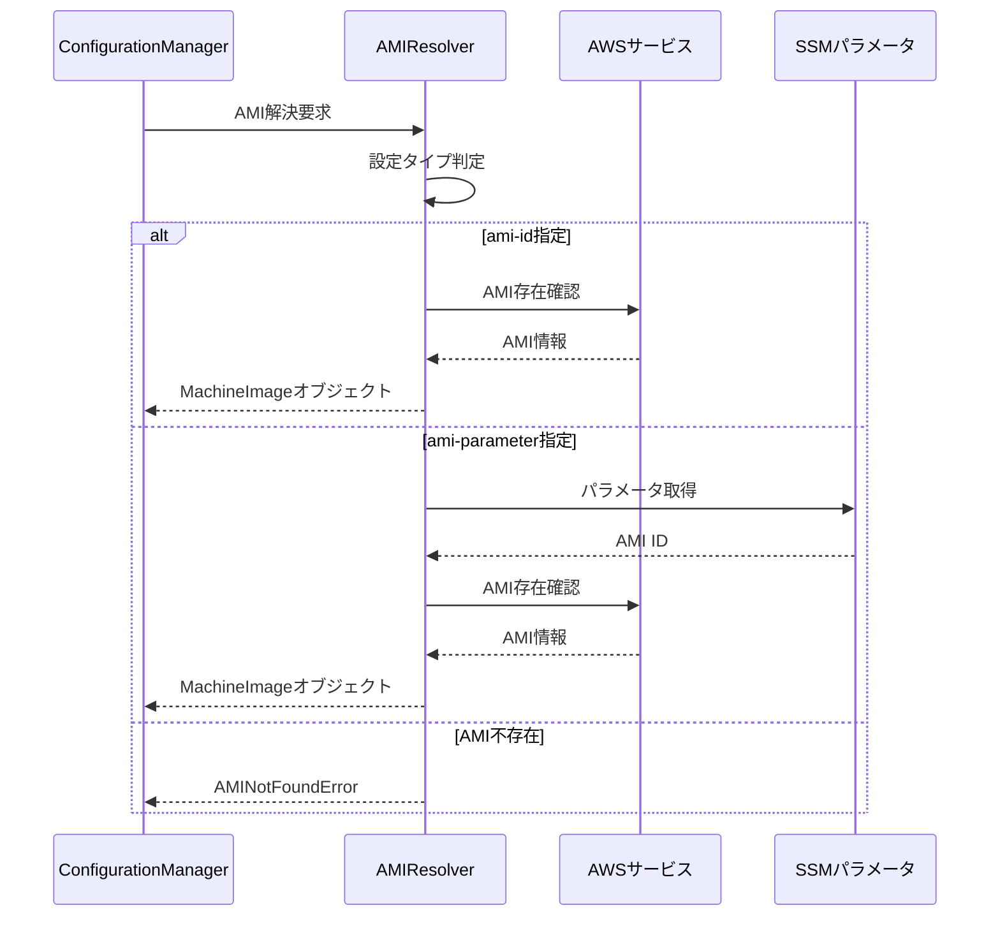
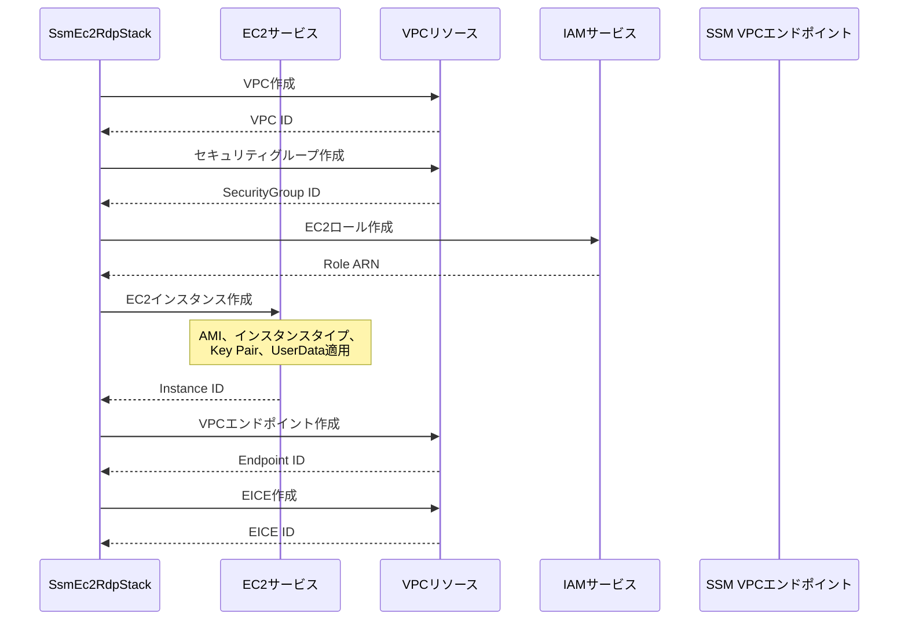
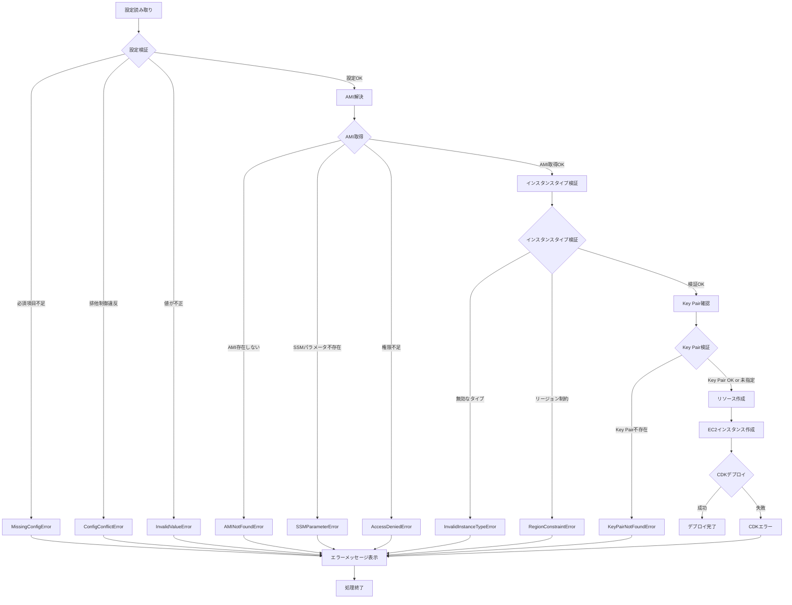
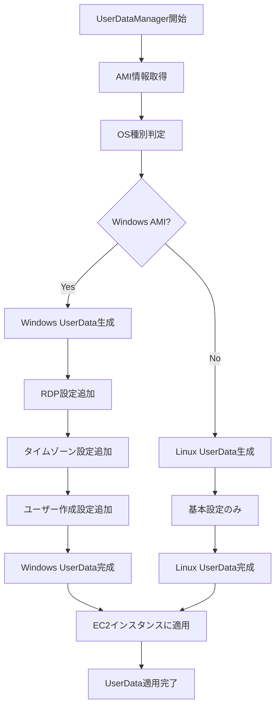
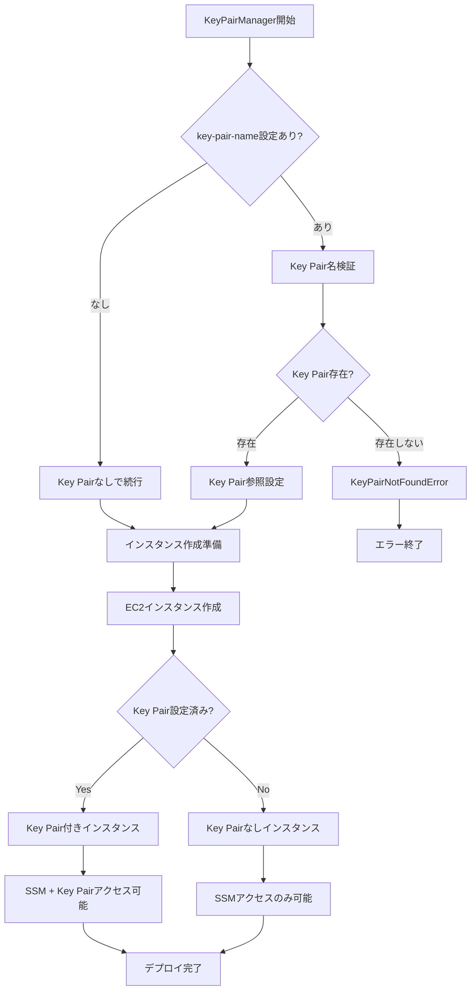

# データフロー図

## システム全体のデータフロー

```mermaid
flowchart TD
    A[開発者] --> B[cdk.json編集]
    B --> C[CDKアプリケーション起動]
    C --> D[ConfigurationManager]
    D --> E{設定検証}
    E -->|成功| F[AMIResolver]
    E -->|失敗| G[エラー終了]
    F --> H{AMI取得}
    H -->|ami-id指定| I[直接AMI使用]
    H -->|ami-parameter指定| J[SSMパラメータ取得]
    J --> K[AMI ID解決]
    I --> L[InstanceTypeValidator]
    K --> L
    L --> M{インスタンスタイプ検証}
    M -->|有効| N[KeyPairManager]
    M -->|無効| G
    N --> O{Key Pair指定あり？}
    O -->|あり| P[Key Pair存在確認]
    O -->|なし| Q[UserDataManager]
    P -->|存在| Q
    P -->|存在しない| G
    Q --> R[OS種別判定]
    R --> S{Windows AMI?}
    S -->|Yes| T[Windows用UserData生成]
    S -->|No| U[Linux用UserData生成]
    T --> V[SsmEc2RdpStack]
    U --> V
    V --> W[EC2リソース作成]
    W --> X[デプロイ完了]
```

## 設定読み取りフロー

```mermaid
sequenceDiagram
    participant Dev as 開発者
    participant CDK as CDKアプリ
    participant CM as ConfigurationManager
    participant JSON as cdk.json
    
    Dev->>CDK: cdk deploy実行
    CDK->>CM: 設定読み取り開始
    CM->>JSON: context値取得
    JSON-->>CM: ami-id/ami-parameter
    JSON-->>CM: instance-type
    JSON-->>CM: key-pair-name（任意）
    CM->>CM: 必須項目確認
    CM->>CM: 排他制御チェック
    alt 設定有効
        CM-->>CDK: 検証済み設定
    else 設定無効
        CM-->>CDK: ValidationError
        CDK-->>Dev: エラー終了
    end
```

## AMI解決フロー

```mermaid
sequenceDiagram
    participant CM as ConfigurationManager
    participant AR as AMIResolver
    participant AWS as AWSサービス
    participant SSM as SSMパラメータ
    
    CM->>AR: AMI解決要求
    AR->>AR: 設定タイプ判定
    
    alt ami-id指定
        AR->>AWS: AMI存在確認
        AWS-->>AR: AMI情報
        AR-->>CM: MachineImageオブジェクト
    else ami-parameter指定
        AR->>SSM: パラメータ取得
        SSM-->>AR: AMI ID
        AR->>AWS: AMI存在確認
        AWS-->>AR: AMI情報
        AR-->>CM: MachineImageオブジェクト
    else AMI不存在
        AR-->>CM: AMINotFoundError
    end
```

## インスタンス作成フロー

```mermaid
sequenceDiagram
    participant Stack as SsmEc2RdpStack
    participant EC2 as EC2サービス
    participant VPC as VPCリソース
    participant IAM as IAMサービス
    participant SSM as SSM VPCエンドポイント
    
    Stack->>VPC: VPC作成
    VPC-->>Stack: VPC ID
    Stack->>VPC: セキュリティグループ作成
    VPC-->>Stack: SecurityGroup ID
    Stack->>IAM: EC2ロール作成
    IAM-->>Stack: Role ARN
    Stack->>EC2: EC2インスタンス作成
    Note over EC2: AMI、インスタンスタイプ、<br/>Key Pair、UserData適用
    EC2-->>Stack: Instance ID
    Stack->>VPC: VPCエンドポイント作成
    VPC-->>Stack: Endpoint ID
    Stack->>VPC: EICE作成
    VPC-->>Stack: EICE ID
```

## エラーハンドリングフロー

```mermaid
flowchart TD
    A[設定読み取り] --> B{設定検証}
    B -->|必須項目不足| C[MissingConfigError]
    B -->|排他制御違反| D[ConfigConflictError]
    B -->|値が不正| E[InvalidValueError]
    B -->|設定OK| F[AMI解決]
    
    F --> G{AMI取得}
    G -->|AMI存在しない| H[AMINotFoundError]
    G -->|SSMパラメータ不存在| I[SSMParameterError]
    G -->|権限不足| J[AccessDeniedError]
    G -->|AMI取得OK| K[インスタンスタイプ検証]
    
    K --> L{インスタンスタイプ検証}
    L -->|無効なタイプ| M[InvalidInstanceTypeError]
    L -->|リージョン制約| N[RegionConstraintError]
    L -->|検証OK| O[Key Pair確認]
    
    O --> P{Key Pair検証}
    P -->|Key Pair不存在| Q[KeyPairNotFoundError]
    P -->|Key Pair OK or 未指定| R[リソース作成]
    
    C --> S[エラーメッセージ表示]
    D --> S
    E --> S
    H --> S
    I --> S
    J --> S
    M --> S
    N --> S
    Q --> S
    S --> T[処理終了]
    
    R --> U[EC2インスタンス作成]
    U --> V{CDKデプロイ}
    V -->|成功| W[デプロイ完了]
    V -->|失敗| X[CDKエラー]
    X --> S
```

## OS判定とUserData適用フロー

```mermaid
flowchart TD
    A[UserDataManager開始] --> B[AMI情報取得]
    B --> C[OS種別判定]
    C --> D{Windows AMI?}
    
    D -->|Yes| E[Windows UserData生成]
    E --> F[RDP設定追加]
    F --> G[タイムゾーン設定追加]
    G --> H[ユーザー作成設定追加]
    H --> I[Windows UserData完成]
    
    D -->|No| J[Linux UserData生成]
    J --> K[基本設定のみ]
    K --> L[Linux UserData完成]
    
    I --> M[EC2インスタンスに適用]
    L --> M
    M --> N[UserData適用完了]
```

## Key Pair管理フロー

```mermaid
flowchart TD
    A[KeyPairManager開始] --> B{key-pair-name設定あり?}
    B -->|なし| C[Key Pairなしで続行]
    B -->|あり| D[Key Pair名検証]
    D --> E{Key Pair存在?}
    E -->|存在| F[Key Pair参照設定]
    E -->|存在しない| G[KeyPairNotFoundError]
    
    C --> H[インスタンス作成準備]
    F --> H
    G --> I[エラー終了]
    
    H --> J[EC2インスタンス作成]
    J --> K{Key Pair設定済み?}
    K -->|Yes| L[Key Pair付きインスタンス]
    K -->|No| M[Key Pairなしインスタンス]
    
    L --> N[SSM + Key Pairアクセス可能]
    M --> O[SSMアクセスのみ可能]
    N --> P[デプロイ完了]
    O --> P
```