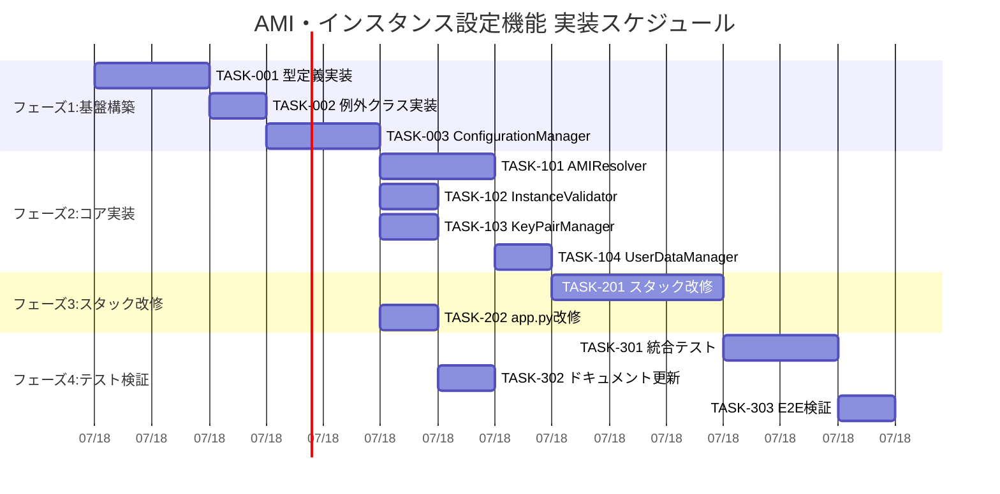

# AMI・インスタンス設定機能 実装タスク

## 概要

全タスク数: 12
推定作業時間: 16時間
クリティカルパス: TASK-001 → TASK-002 → TASK-003 → TASK-101 → TASK-201 → TASK-301

## タスク一覧

### フェーズ1: 基盤構築

#### TASK-001: 型定義とインターフェースの実装

- [x] **タスク完了**
- **タスクタイプ**: TDD
- **要件リンク**: REQ-001, REQ-002, REQ-202, REQ-203
- **依存タスク**: なし
- **実装詳細**:
  - `ssm_ec2_rdp/types.py` の作成
  - `EC2Configuration`, `AMIConfiguration`, `InstanceConfiguration` データクラス
  - `OSType` 列挙型の定義
  - 設定値バリデーション機能
- **テスト要件**:
  - [ ] 単体テスト: 各データクラスのバリデーション
  - [ ] エラーケーステスト: 不正な設定値での例外発生
  - [ ] 境界値テスト: AMI ID、インスタンスタイプ形式チェック
- **完了条件**:
  - [ ] 全データクラスが定義されている
  - [ ] バリデーション機能が動作している
  - [ ] テストカバレッジ90%以上

#### TASK-002: カスタム例外クラスの実装

- [x] **タスク完了**
- **タスクタイプ**: TDD
- **要件リンク**: REQ-202, REQ-203, EDGE-001, EDGE-002, EDGE-003, EDGE-004
- **依存タスク**: TASK-001
- **実装詳細**:
  - `ssm_ec2_rdp/exceptions.py` の作成
  - `ConfigurationError` 基底クラス
  - `MissingConfigError`, `ConfigConflictError`, `InvalidValueError`
  - `AMINotFoundError`, `KeyPairNotFoundError`
  - 適切なエラーメッセージテンプレート
- **テスト要件**:
  - [ ] 例外継承関係のテスト
  - [ ] エラーメッセージ内容のテスト
  - [ ] 例外発生パターンのテスト
- **完了条件**:
  - [ ] 全カスタム例外が定義されている
  - [ ] エラーメッセージが日本語で適切に表示される

#### TASK-003: ConfigurationManagerの実装

- [x] **タスク完了**
- **タスクタイプ**: TDD
- **要件リンク**: REQ-001, REQ-002, REQ-103, REQ-104, REQ-201
- **依存タスク**: TASK-001, TASK-002
- **実装詳細**:
  - `ssm_ec2_rdp/configuration_manager.py` の作成
  - cdk.json Context APIからの設定読み取り
  - 設定検証ロジック
  - デフォルト値の適用
  - エラーハンドリング
- **テスト要件**:
  - [ ] 単体テスト: 設定読み取りロジック
  - [ ] 統合テスト: CDK Appとの連携
  - [ ] エラーケース: 設定不足、競合設定
- **エラーハンドリング**:
  - [ ] 必須設定項目の不足
  - [ ] AMI設定の競合（ami-id と ami-parameter 両方指定）
  - [ ] 不正な設定値の検出
- **完了条件**:
  - [ ] cdk.jsonから正常に設定を読み取れる
  - [ ] 設定検証が適切に動作する
  - [ ] エラー時に明確なメッセージが表示される

### フェーズ2: コアコンポーネント実装

#### TASK-101: AMIResolverの実装

- [x] **タスク完了**
- **タスクタイプ**: TDD
- **要件リンク**: REQ-003, REQ-101, REQ-102, REQ-105
- **依存タスク**: TASK-003
- **実装詳細**:
  - `ssm_ec2_rdp/ami_resolver.py` の作成
  - 直接AMI ID指定の処理
  - SSMパラメータからのAMI取得
  - Windows/Linux AMIの自動判定
  - MachineImageオブジェクト生成
- **テスト要件**:
  - [ ] 単体テスト: AMI ID直接指定
  - [ ] 単体テスト: SSMパラメータ指定
  - [ ] モックテスト: AWS API呼び出し
  - [ ] OS判定ロジックテスト
- **エラーハンドリング**:
  - [ ] 存在しないAMI IDの処理
  - [ ] 存在しないSSMパラメータの処理
  - [ ] AWS API エラーの処理
- **完了条件**:
  - [ ] 両方の指定方法でMachineImageが生成される
  - [ ] OS種別が正しく判定される
  - [ ] エラー時に適切な例外が発生する

#### TASK-102: InstanceTypeValidatorの実装

- [x] **タスク完了**
- **タスクタイプ**: TDD
- **要件リンク**: REQ-004, REQ-104, EDGE-003, EDGE-102
- **依存タスク**: TASK-003
- **実装詳細**:
  - `ssm_ec2_rdp/instance_type_validator.py` の作成
  - インスタンスタイプ形式の検証
  - 基本的な妥当性チェック
  - 分かりやすいエラーメッセージ
- **テスト要件**:
  - [ ] 単体テスト: 有効なインスタンスタイプ
  - [ ] 単体テスト: 無効なインスタンスタイプ
  - [ ] 境界値テスト: 形式チェック
- **エラーハンドリング**:
  - [ ] 無効なインスタンスタイプ形式
  - [ ] サポートされていないタイプの検出
- **完了条件**:
  - [ ] インスタンスタイプの形式チェックが動作する
  - [ ] 適切なバリデーションエラーが表示される

#### TASK-103: KeyPairManagerの実装

- [ ] **タスク完了**
- **タスクタイプ**: TDD
- **要件リンク**: REQ-401, REQ-402（Key Pair関連部分）
- **依存タスク**: TASK-003
- **実装詳細**:
  - `ssm_ec2_rdp/key_pair_manager.py` の作成
  - Key Pair存在確認（任意機能）
  - CDK KeyPair参照の生成
  - Key Pairなしでの処理サポート
- **テスト要件**:
  - [ ] 単体テスト: Key Pair指定時の処理
  - [ ] 単体テスト: Key Pair未指定時の処理
  - [ ] モックテスト: CDK KeyPair参照
- **エラーハンドリング**:
  - [ ] 存在しないKey Pairの処理
  - [ ] Key Pair参照エラーの処理
- **完了条件**:
  - [ ] Key Pair指定時に適切な参照が生成される
  - [ ] Key Pair未指定時にNoneが返される
  - [ ] エラー時に適切な例外が発生する

#### TASK-104: UserDataManagerの実装

- [ ] **タスク完了**
- **タスクタイプ**: TDD
- **要件リンク**: REQ-005, REQ-105, EDGE-202
- **依存タスク**: TASK-101
- **実装詳細**:
  - `ssm_ec2_rdp/user_data_manager.py` の作成
  - Windows用ユーザーデータ生成
  - Linux用ユーザーデータ生成
  - OS種別による動的切り替え
  - 既存のWindows設定の保持
- **テスト要件**:
  - [ ] 単体テスト: Windows AMI用ユーザーデータ
  - [ ] 単体テスト: Linux AMI用ユーザーデータ  
  - [ ] 統合テスト: OS判定との連携
- **完了条件**:
  - [ ] Windows AMI時にRDP設定等が含まれる
  - [ ] Linux AMI時に基本設定のみが含まれる
  - [ ] 動的な設定切り替えが動作する

### フェーズ3: スタック改修

#### TASK-201: SsmEc2RdpStackの改修

- [ ] **タスク完了**
- **タスクタイプ**: TDD
- **要件リンク**: REQ-001, REQ-003, REQ-004, REQ-401, REQ-402
- **依存タスク**: TASK-101, TASK-102, TASK-103, TASK-104
- **実装詳細**:
  - `ssm_ec2_rdp/ssm_ec2_rdp_stack.py` の改修
  - コンストラクタの変更（EC2Configuration受け取り）
  - 各マネージャーの統合
  - 既存リソース作成ロジックとの統合
  - インスタンス作成パラメータの動的設定
- **テスト要件**:
  - [ ] 単体テスト: スタック初期化
  - [ ] 統合テスト: 全コンポーネント連携
  - [ ] CloudFormationテンプレート検証
- **エラーハンドリング**:
  - [ ] 設定エラーの適切な伝播
  - [ ] CDKエラーハンドリング
- **完了条件**:
  - [ ] 新しい設定形式でスタックが作成される
  - [ ] 既存のVPC、セキュリティグループ設定が保持される
  - [ ] インスタンスが正常に作成される

#### TASK-202: app.pyの改修

- [ ] **タスク完了**
- **タスクタイプ**: TDD
- **要件リンク**: REQ-201, NFR-202
- **依存タスク**: TASK-003, TASK-201
- **実装詳細**:
  - `app.py` の改修
  - ConfigurationManagerの統合
  - エラーハンドリングの追加
  - ヘルプメッセージの表示
  - 適切な終了処理
- **テスト要件**:
  - [ ] 統合テスト: アプリケーション起動
  - [ ] エラーケース: 設定不正時の動作
  - [ ] ヘルプメッセージ表示テスト
- **エラーハンドリング**:
  - [ ] 設定エラー時の適切な終了
  - [ ] エラーメッセージとヘルプの表示
- **完了条件**:
  - [ ] 新しい設定でアプリケーションが起動する
  - [ ] エラー時に分かりやすいメッセージが表示される
  - [ ] 既存のCDK機能が正常に動作する

### フェーズ4: テスト・検証

#### TASK-301: 統合テストスイートの作成

- [ ] **タスク完了**
- **タスクタイプ**: TDD
- **要件リンク**: 全要件の統合テスト
- **依存タスク**: TASK-201, TASK-202
- **実装詳細**:
  - `tests/integration/` ディレクトリの作成
  - 複数の設定パターンでのテスト
  - CDKスタック作成テスト
  - CloudFormationテンプレート検証
  - エラーケースの網羅的テスト
- **テスト要件**:
  - [ ] AMI ID直接指定でのスタック作成
  - [ ] SSMパラメータ指定でのスタック作成
  - [ ] 各種インスタンスタイプでのテスト
  - [ ] Key Pairありなしの両パターン
  - [ ] エラーケースの全パターン
- **完了条件**:
  - [ ] 全設定パターンでテストが通る
  - [ ] エラーケースが適切にハンドリングされる
  - [ ] CloudFormationテンプレートが正しく生成される

#### TASK-302: ドキュメント更新

- [ ] **タスク完了**
- **タスクタイプ**: DIRECT
- **要件リンク**: NFR-201, NFR-202
- **依存タスク**: TASK-301
- **実装詳細**:
  - `README.md` の更新
  - 設定例の追加
  - 移行ガイドの作成
  - トラブルシューティングガイドの更新
- **完了条件**:
  - [ ] 新しい設定方式が文書化されている
  - [ ] 設定例が豊富に提供されている
  - [ ] 既存設定からの移行手順が明確

#### TASK-303: E2E テスト環境での検証

- [ ] **タスク完了**
- **タスクタイプ**: TDD
- **要件リンク**: NFR-001, NFR-002, NFR-102
- **依存タスク**: TASK-301, TASK-302
- **実装詳細**:
  - 実際のAWS環境でのデプロイテスト
  - Windows AMI、Linux AMIでの動作確認
  - SSM Session Manager接続テスト
  - Key Pair接続テスト（指定時）
  - パフォーマンステスト
- **テスト要件**:
  - [ ] Windows Server AMI での RDP 機能確認
  - [ ] Amazon Linux AMI での基本動作確認
  - [ ] SSM Session Manager 接続確認
  - [ ] デプロイ時間の測定（30秒以内）
  - [ ] リソース作成の完全性確認
- **完了条件**:
  - [ ] 実環境で全機能が正常動作する
  - [ ] パフォーマンス要件を満たしている
  - [ ] セキュリティ機能が適切に動作する

## 実行順序

## マイルストーン

### マイルストーン1: 基盤完成 (4時間)
- [ ] TASK-001, TASK-002, TASK-003完了
- [ ] 設定読み取り・検証機能が動作

### マイルストーン2: コアロジック完成 (9時間)
- [ ] TASK-101, TASK-102, TASK-103, TASK-104完了
- [ ] 全マネージャーコンポーネントが動作

### マイルストーン3: スタック統合完成 (13時間) 
- [ ] TASK-201, TASK-202完了
- [ ] 新設定でCDKスタックが動作

### マイルストーン4: 本番準備完了 (16時間)
- [ ] TASK-301, TASK-302, TASK-303完了
- [ ] 本番デプロイ準備完了

## リスクと対策

### 高リスク
- **AWS API制限**: SSMパラメータアクセスのレート制限
  - 対策: 適切なリトライ機構の実装
- **AMI存在確認**: リージョン固有のAMI ID問題
  - 対策: 事前のAMI存在確認とエラーハンドリング

### 中リスク
- **CDK互換性**: 既存CDKバージョンとの互換性
  - 対策: CDKバージョン固定と段階的テスト
- **テストデータ**: 実際のAMI IDを使用したテスト
  - 対策: モックとスタブの活用

## 品質基準

### コード品質
- [ ] テストカバレッジ: 90%以上
- [ ] 型ヒント: 100%カバー
- [ ] Linting: flake8, black, mypy通過

### ドキュメント品質
- [ ] 全関数にdocstring
- [ ] 設定例の充実
- [ ] エラーメッセージの日本語化

### パフォーマンス
- [ ] 設定読み取り: 1秒以内
- [ ] AMI解決: 30秒以内（要件準拠）
- [ ] スタック作成: 既存と同等時間